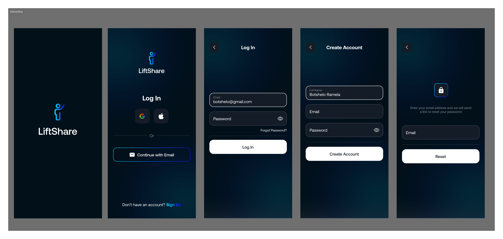
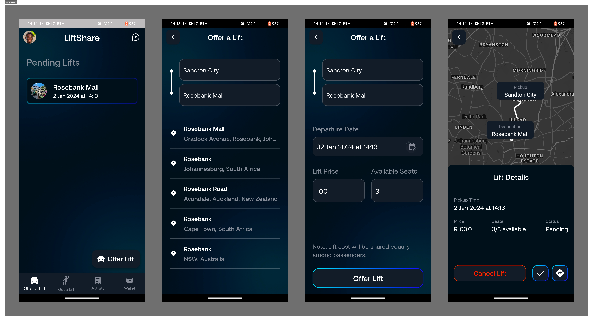
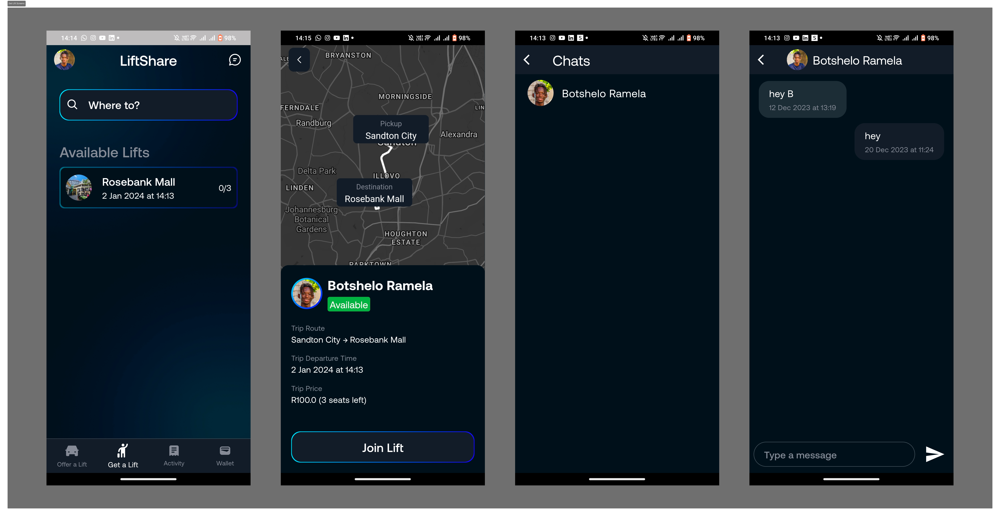
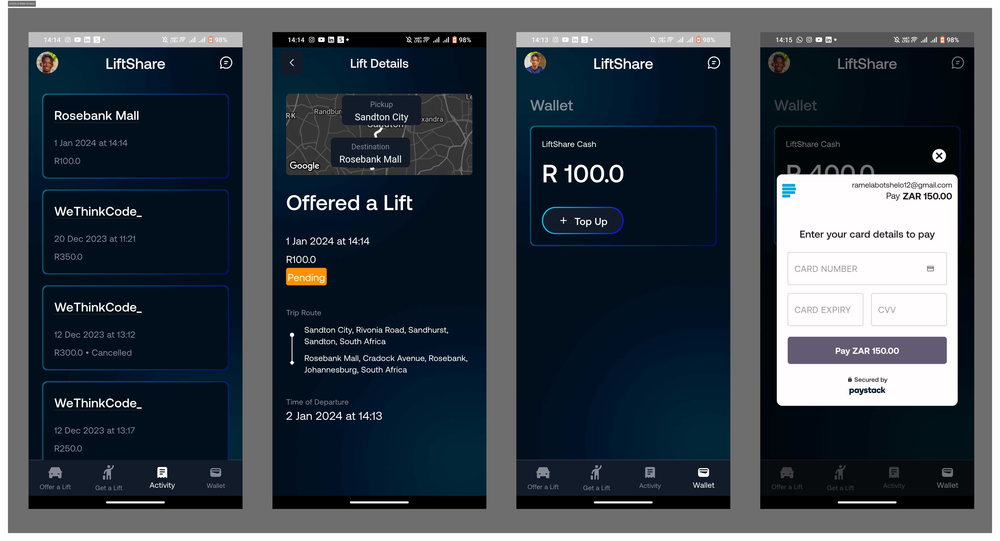

# LiftShare

## Project Description

The LiftShare app, developed as my final project for the Mobile Development elective at WeThinkCode in December 2023, is meticulously crafted to simplify the process of organizing or joining rides to specific destinations. Targeted primarily at assisting students and individuals facing budget constraints, the app provides a user-friendly platform. It empowers users to offer lifts, search for available rides, confirm or cancel rides, and incorporates essential features for notifications and onboarding. With a focus on enhancing the commuting experience, the LiftShare app aims to foster a community-driven approach to transportation.

## Technologies Used

- **Flutter**: The app is built using the Flutter framework for cross-platform mobile development.
- **Firebase**: Used for backend services, including authentication and real-time database functionality.
- **PayStack**: Integrated for payment processing within the app.
- **Google Maps API**: Utilized to enhance location-based features.
- **MVVM Architecture**: The app follows the Model-View-ViewModel architectural pattern for a scalable and maintainable codebase.

## Project Structure
```
lib
|-- data
|   |-- models
|   |   |-- lift.dart
|   |   |-- notification.dart
|   |   |-- user.dart
|   |-- repositories
|   |   |-- lift_repository.dart
|   |   |-- notification_repository.dart
|   |   |-- user_repository.dart
|-- providers
|   |-- user_provider.dart
|-- services
|   |-- authentication_service.dart
|   |-- google_maps_service.dart
|   |-- chat_service.dart
|   |-- paystack_service.dart
|-- ui
|   |-- screens
|   |   |-- activity
|   |   |   |-- activity_details_screen.dart
|   |   |   |-- home_screen.dart
|   |   |-- chats
|   |   |   |-- chats_screen.dart
|   |   |   |-- messaging_screen.dart
|   |   |-- get_a_lift
|   |   |   |-- home_screen.dart
|   |   |   |-- join_lift_screen.dart
|   |   |   |-- lift_details_screen.dart
|   |   |   |-- search_lift_screen.dart
|   |   |-- offer_a_lift
|   |   |   |-- confirmed_lift_offer_screen.dart
|   |   |   |-- home_screen.dart
|   |   |   |-- offer_lift_screen.dart
|   |   |-- onboarding
|   |   |   |-- create_account_screen.dart
|   |   |   |-- login_screen.dart
|   |   |   |-- reset_password_screen.dart
|   |   |   |-- welcome_screen.dart
|   |   |-- user
|   |   |   |-- edit_profile_screen.dart
|   |   |   |-- profile_screen.dart
|   |   |-- wallet
|   |   |   |-- home_screen.dart
|   |   |-- main_screen.dart
|   |-- widgets
|   |   |-- app_button.dart
|   |   |-- app_card.dart
|   |   |-- app_textfield.dart
|-- utils
|   |-- constants.dart
|   |-- enums.dart
|   |-- firebase_utils.dart
|-- viewmodels
|   |-- lift_viewmodel.dart
|   |-- profile_viewmodel.dart
|-- firebase_options.dart
|-- main.dart
```

Explanation:

- `data`: Manages data-related concerns such as models and repositories.
    - `models`: Data models representing entities like User, Lift, and Notification.
    - `repositories`: Classes responsible for handling data operations for each entity.
- `providers`: Contains provider classes for managing state.
- `services`: Handles external services like Firebase, PayStack, Google Maps, and in-app messaging.
- `ui`: Contains UI-related components, organized by screens and functionality.
    - `screens`: Divided into sub-folders based on the user journey or feature.
    - `widgets`: Reusable widgets used across multiple screens.
- `utils`: Contains utility classes and constants used throughout the app
- `viewmodels`: Manages the application's logic, following the MVVM pattern.
- `firebase_options.dart`: Contains Firebase configuration options.
- `main.dart`: The entry point of the application


## App Sceenshots
 




## Getting Started

### Prerequisites

- [Flutter SDK](https://flutter.dev/docs/get-started/install)
- [Firebase Project](https://console.firebase.google.com/): Set up a project on Firebase and configure the necessary services.
- [Paystack API Key](https://dashboard.paystack.com/): Obtain an API key for payment processing.
- [Google Maps API Key](https://cloud.google.com/maps-platform/): Get an API key for using Google Maps services.

### Environment Variables

Create a `.env` file in the root directory of the project and add the following:

```env
# Firebase & Google Cloud Configuration
ANDROID_FIREBASE_API_KEY=your_firebase_api_key
ANDROID_FIREBASE_APP_ID=your_firebase_app_id
IOS_FIREBASE_API_KEY=your_firebase_api_key
IOS_FIREBASE_APP_ID=your_firebase_app_id
FIREBASE_MESSAGING_SENDER_ID=your_firebase_messaging_sender_id
FIREBASE_PROJECT_ID=your_firebase_project_id
FIREBASE_STORAGE_BUCKET=your_firebase_storage_bucket
FIREBASE_IOS_BUNDLED_ID=your_firebase_ios_bundled_id
GOOGLE_CLOUD_MAP_ID=your_google_cloud_map_id

# PayStack Configuration
PAYSTACK_API_PUBLIC_KEY=your_paystack_public_api_key
```

Replace the placeholder values with your actual API keys and Firebase configuration.

## Running the App
1. Clone the repository: `git clone https://github.com/BotsheloRamela/LiftShare.git`
2. Navigate to the project directory: `cd LiftShare`
3. Install dependencies: `flutter pub get`
4. Run the app: `flutter run`
